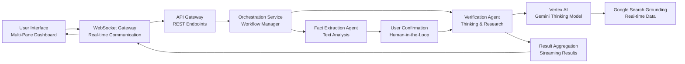
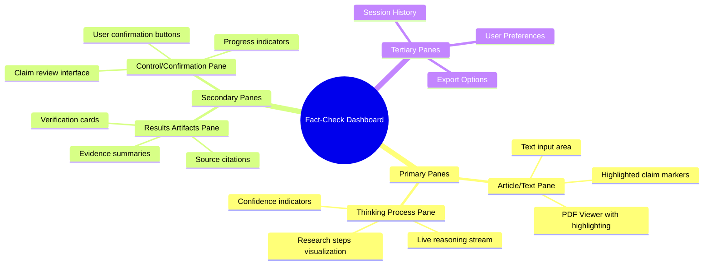
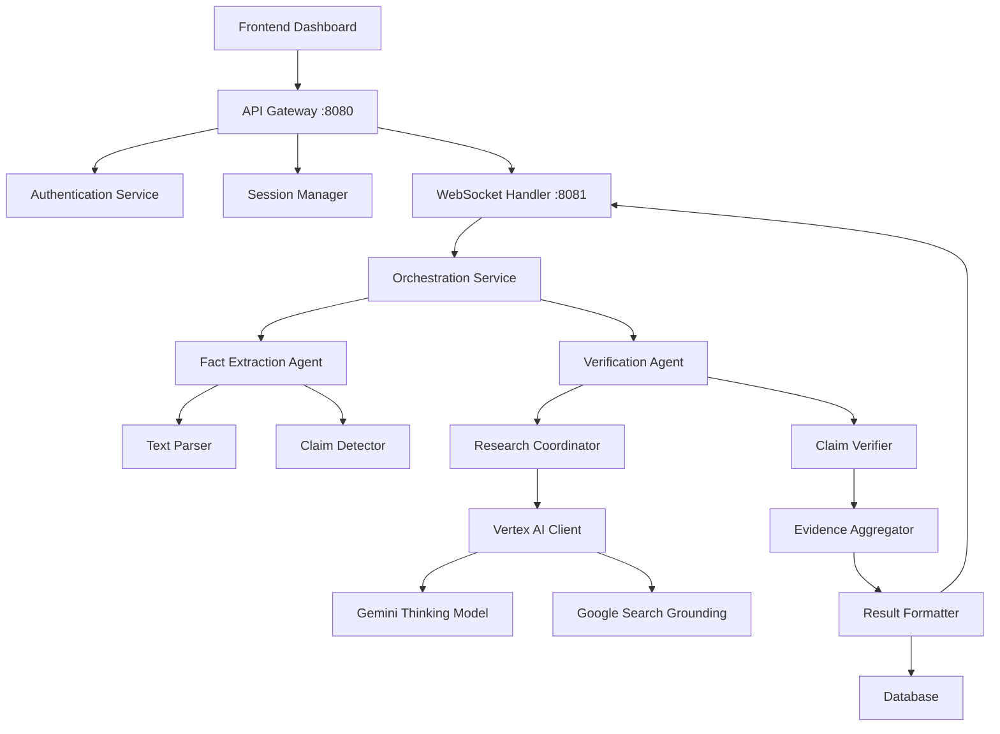
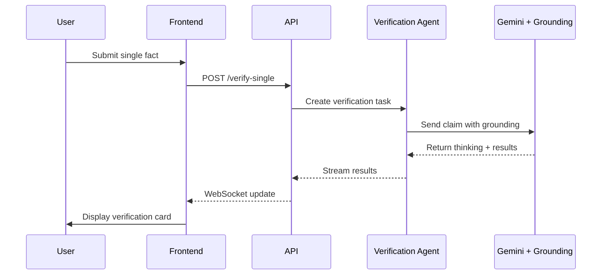
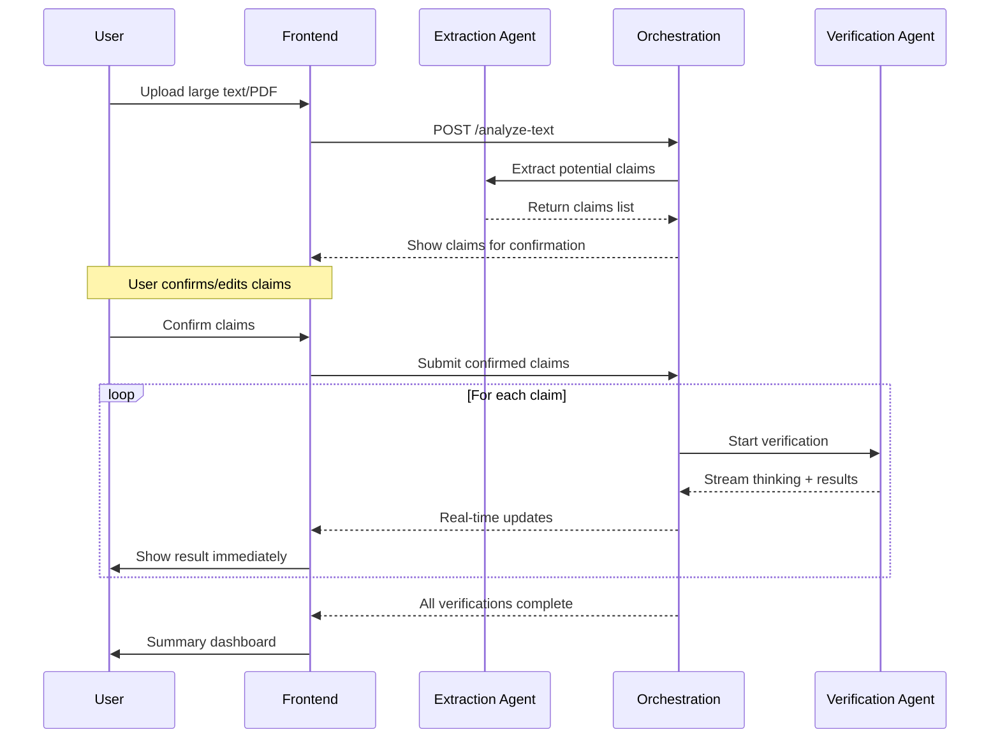

# 🎯 Final Project Plan: Agentic Fact-Checking Tool for Editorial Work

**Date:** October 26, 2023
**Version:** 1.0
**Status:** Ready for Development

---

## 📋 Executive Summary

This document outlines a comprehensive architecture and implementation plan for an **Agentic Fact-Checking Tool** designed for editorial workflows. The system features two operational modes: single-fact verification and bulk text analysis with human-in-the-loop confirmation. The architecture leverages Google's latest AI capabilities with a modern, reactive frontend to create a professional-grade fact-checking assistant.

---

## 🏗️ System Architecture Overview



---

## 🔧 Recommended Tech Stack

### **AI & Backend Core**
| Component | Technology | Rationale & Documentation |
|-----------|------------|---------------------------|
| **LLM Engine** | Gemini Thinking Models (`gemini-2.5-pro`, `gemini-2.5-flash`) | Advanced reasoning capabilities for fact verification. Gemini 2.5 Pro excels at complex analysis and STEM reasoning. |
| **Grounding Service** | Google Search Grounding via Vertex AI | Connects Gemini to real-time web content with verifiable citations. Provides factual accuracy beyond knowledge cutoff. |
| **Backend Framework** | FastAPI (Python) | High-performance async framework, perfect for AI integrations. Native WebSocket support. |
| **Agent Framework** | LangChain/LangGraph or Google's Agent Development Kit | Proven patterns for building AI agents. Google ADK specifically designed for fact-checking pipelines. |
| **PDF Processing** | PyPDF2 + pdfplumber + custom LLM extraction | Robust text extraction and parsing capabilities. |

### **Frontend Architecture**
| Component | Technology | Rationale |
|-----------|------------|-----------|
| **Framework** | React 18+ with TypeScript | Mature ecosystem, strong typing for complex state management. |
| **Agentic UI** | Custom implementation + AG-UI protocol patterns | AG-UI provides standardized patterns for agentic backends-frontend communication. |
| **PDF Viewer** | PDF.js (Mozilla) + custom annotation layer | Industry standard, supports highlighting and annotations. |
| **State Management** | Zustand (UI state) + React Query (server state) | Separate AI state from UI state as recommended for AI frontends. |
| **Real-time Updates** | WebSocket client (native) + React Streaming | Enables real-time thinking process display and result streaming. |

### **Infrastructure & DevOps**
| Component | Technology | Notes |
|-----------|------------|-------|
| **Cloud Platform** | Google Cloud Platform | Native integration with Vertex AI and Search Grounding. |
| **Containerization** | Docker + Kubernetes | Standard for scalable AI applications. |
| **Database** | PostgreSQL (metadata) + Redis (caching/state) | Relational data for users, sessions; Redis for temporary state. |
| **Queue System** | Celery + Redis | Background task processing for long-running verifications. |

---

## 🎨 Frontend Design: Creative Multi-Pane Dashboard

### **Layout Architecture**
The frontend should use a **dashboard-style multi-pane layout** that evolves with the user's workflow. Here's the proposed interface structure:



### **Creative UI Features**

#### **1. Article/Text Pane (Left 40%)**
- **PDF Viewer**: Full-featured PDF.js viewer with custom annotation layer
  - Users can highlight text directly
  - Right-click context menu for fact-checking
  - Visual markers for identified claims
- **Text Input**: Rich text editor for pasted text
  - Auto-detection of potential claims
  - Highlighting of suspicious phrases
  - Real-time parsing feedback

#### **2. Thinking Process Pane (Middle 25%)**
- **Live Reasoning Stream**: Real-time display of AI's thought process
  ```javascript
  // Example streaming format
  const thinkingUpdate = {
    phase: "research",
    step: "Searching public records",
    confidence: 0.85,
    sources: ["https://..."],
    timestamp: "2026-02-13T10:30:00Z"
  };
  ```
- **Visual Progress**: Circular progress indicators per claim
- **Research Depth**: Visual indicators for shallow vs deep research

#### **3. Results Artifacts Pane (Right 35%)**
- **Verification Cards**: Each claim becomes a clickable card
  - Color-coded verification status (Verified, Unverified, Disputed)
  - Confidence score with visual indicator
  - Expandable source list
  - Quick links to primary sources

#### **4. Control/Confirmation Pane (Bottom)**
- **Claim Review**: List of detected claims requiring confirmation
  - Checkboxes for user approval
  - Text boxes for user-added claims
  - "Add Claim" button for missed items
- **Progress Tracker**: Overall verification progress bar

### **Interactive Elements**
- **Drag-and-drop**: Drag claims between panes for reorganization
- **Split-screen views**: Compare original text with verified sources
- **Hover tooltips**: Detailed explanations on verification results
- **Keyboard shortcuts**: Power user features for editorial workflows

---

## 🔧 Backend Architecture: Microservices Design

### **Service Architecture**



### **Core Services Implementation**

#### **1. Orchestration Service (Core)**
```python
# core/orchestration_service.py
from typing import List, Dict, Optional
import asyncio
from datetime import datetime

class OrchestrationService:
    def __init__(self):
        self.active_sessions = {}
        self.agent_coordinator = AgentCoordinator()
        
    async def process_text(self, text: str, session_id: str, user_confirmations: Optional[List] = None):
        """Main orchestration method for text processing"""
        
        # Phase 1: Claim extraction (if not confirmed)
        if not user_confirmations:
            claims = await self.agent_coordinator.extract_claims(text)
            return {
                "status": "awaiting_confirmation",
                "claims": claims,
                "session_id": session_id
            }
        
        # Phase 2: Verification with streaming
        verification_tasks = []
        for claim in user_confirmations:
            task = asyncio.create_task(
                self.agent_coordinator.verify_claim_streaming(
                    claim, 
                    session_id,
                    progress_callback=self.stream_update
                )
            )
            verification_tasks.append(task)
        
        # Stream results as they complete
        results = []
        for future in asyncio.as_completed(verification_tasks):
            result = await future
            results.append(result)
            await self.stream_result(result, session_id)
        
        return {
            "status": "completed",
            "results": results,
            "session_id": session_id
        }
    
    async def stream_update(self, update: Dict, session_id: str):
        """Stream thinking process updates via WebSocket"""
        # Implementation for WebSocket streaming
        pass
```

#### **2. Verification Agent (Specialized)**
```python
# agents/verification_agent.py
from vertexai.preview.generative_models import GenerativeModel
from google.cloud import aiplatform

class VerificationAgent:
    def __init__(self):
        self.project_id = "your-project-id"
        aiplatform.init(project=self.project_id)
        
        # Gemini thinking model with grounding
        self.model = GenerativeModel("gemini-2.5-pro")
        
    async def verify_with_thinking(self, claim: str):
        """Verify claim using thinking process and grounding"""
        
        # Configure grounding with Google Search
        grounding_tool = {
            "google_search_retrieval": {
                "disable_attribution": False  # Keep citations
            }
        }
        
        # Start thinking process
        response = await self.model.generate_content_async(
            f"""Verify the following factual claim. Provide:
            1. Your thinking process
            2. Verification status (Verified/Unverified/Disputed)
            3. Confidence level (0-1)
            4. Supporting evidence with sources
            
            Claim: {claim}
            
            Use Google Search grounding for real-time information.
            """,
            tools=[grounding_tool],
            generation_config={
                "temperature": 0.1,  # Low temperature for factual accuracy
                "max_output_tokens": 2048
            }
        )
        
        # Parse thinking process and verification
        return self.parse_verification_response(response)
```

#### **3. WebSocket Handler for Real-time Updates**
```python
# websocket/handler.py
from fastapi import WebSocket
from typing import Dict, List
import json

class ConnectionManager:
    def __init__(self):
        self.active_connections: Dict[str, List[WebSocket]] = {}
    
    async def connect(self, websocket: WebSocket, session_id: str):
        await websocket.accept()
        if session_id not in self.active_connections:
            self.active_connections[session_id] = []
        self.active_connections[session_id].append(websocket)
    
    async def broadcast_update(self, session_id: str, message: dict):
        """Broadcast thinking updates to all connections for a session"""
        if session_id in self.active_connections:
            for connection in self.active_connections[session_id]:
                await connection.send_json(message)
    
    async def stream_thinking_process(self, session_id: str, thinking_data: dict):
        """Stream thinking process to frontend in real-time"""
        message = {
            "type": "thinking_update",
            "data": thinking_data,
            "timestamp": datetime.utcnow().isoformat()
        }
        await self.broadcast_update(session_id, message)
```

---

## 📊 Data Flow & Operational Modes

### **Mode 1: Single Fact Verification**


### **Mode 2: Bulk Text Analysis**


---

## 🚀 Implementation Roadmap

### **Phase 1: Foundation (Weeks 1-4)**
- [ ] Set up Google Cloud project and enable Vertex AI API
- [ ] Implement basic FastAPI backend with authentication
- [ ] Create React frontend skeleton with multi-pane layout
- [ ] Integrate basic Gemini model without grounding
- [ ] Implement WebSocket connection for real-time updates

### **Phase 2: Core Fact-Checking Pipeline (Weeks 5-8)**
- [ ] Implement claim extraction agent with text parsing
- [ ] Integrate Google Search Grounding with Gemini thinking models
- [ ] Build human-in-the-loop confirmation workflow
- [ ] Create result streaming and aggregation pipeline
- [ ] Implement PDF upload and text extraction

### **Phase 3: Frontend Polish & Advanced Features (Weeks 9-12)**
- [ ] Build interactive PDF viewer with highlighting
- [ ] Implement real-time thinking process display
- [ ] Create verification artifact cards with source links
- [ ] Add user preferences and export functionality
- [ ] Performance optimization and caching

### **Phase 4: Testing & Deployment (Weeks 13-16)**
- [ ] Comprehensive testing (unit, integration, security)
- [ ] Load testing and performance optimization
- [ ] Documentation and API specification
- [ ] Deployment to production environment
- [ ] User acceptance testing and iteration

---

## 🛡️ Security & Privacy Considerations

### **Security Implementation**

1. **Authentication & Authorization**
   - JWT-based authentication
   - Role-based access control (RBAC) for editorial teams
   - Session management with WebSocket tokens

2. **Data Protection**
   - At-rest encryption for all stored documents
   - In-transit encryption (TLS 1.3)
   - PII detection and anonymization for sensitive documents

3. **AI Safety**
   - Input validation and sanitization
   - Output filtering for potentially harmful content
   - Rate limiting per user/session

4. **Privacy Compliance**
   - GDPR-compliant data handling
   - User consent management
   - Data retention policies

---

## 💡 Innovative Features for Editorial Work

### **1. Adaptive Research Depth**
The system automatically adjusts research depth based on claim complexity:
- **Simple Claims**: Quick verification with primary sources
- **Complex Claims**: Deep research with multiple corroborating sources
- **Controversial Topics**: Balanced analysis from multiple perspectives

### **2. Editorial Workflow Integration**
- **Style Guide Integration**: Cross-verification with publication style guides
- **Fact-Check Database**: Build institutional knowledge over time
- **Collaboration Tools**: Share verification results with team members

### **3. Intelligent Claim Detection**
- **Contextual Analysis**: Understand claims within their article context
- **Statistical Claim Detection**: Identify numerical claims requiring verification
- **Quote Attribution**: Verify attributions and quote accuracy

### **4. Visualization Dashboard**
- **Verification Heat Map**: Visualize verification confidence across articles
- **Source Diversity Analysis**: Ensure balanced sourcing
- **Trend Analysis**: Track common fact-checking challenges over time

---

## 📈 Success Metrics & KPIs

| Metric | Target | Measurement Method |
|--------|--------|-------------------|
| Verification Accuracy | >95% | Human audit of verification results |
| Processing Speed | <3 minutes per claim | System performance metrics |
| User Satisfaction | >4.5/5 | User feedback surveys |
| System Uptime | >99.9% | Monitoring infrastructure |
| False Positive Rate | <5% | Human verification of system flags |

---

## 🔄 Maintenance & Evolution Plan

### **Continuous Improvement**
1. **Model Fine-tuning**: Regularly update models based on feedback
2. **Source Database Expansion**: Continuously update trusted source list
3. **Feature Enhancement**: Based on editorial team feedback
4. **Performance Monitoring**: Real-time system health dashboards

### **Scalability Considerations**
- **Horizontal Scaling**: Add more verification agents as needed
- **Caching Strategies**: Cache frequently verified claims
- **Queue Management**: Prioritize urgent fact-checking requests

---

## 🎯 Final Recommendation

This architecture provides a **robust, scalable foundation** for an agentic fact-checking tool specifically designed for editorial workflows. The combination of:

1. **Gemini Thinking Models** with **Google Search Grounding** for accurate, real-time verification
2. **Multi-pane agentic UI** following modern AI-first interface patterns
3. **Real-time streaming architecture** for transparent AI reasoning
4. **Human-in-the-loop workflow** for editorial control and trust

creates a professional-grade tool that significantly enhances editorial fact-checking capabilities while maintaining transparency and user control.

The architecture is designed to be **developed incrementally**, with each phase delivering tangible value, allowing for iterative refinement based on real-world editorial feedback.

> **Next Step**: Begin with Phase 1 foundation implementation, focusing on core infrastructure and basic Gemini integration. The modular design allows for parallel development of frontend and backend components once the foundation is established.
```